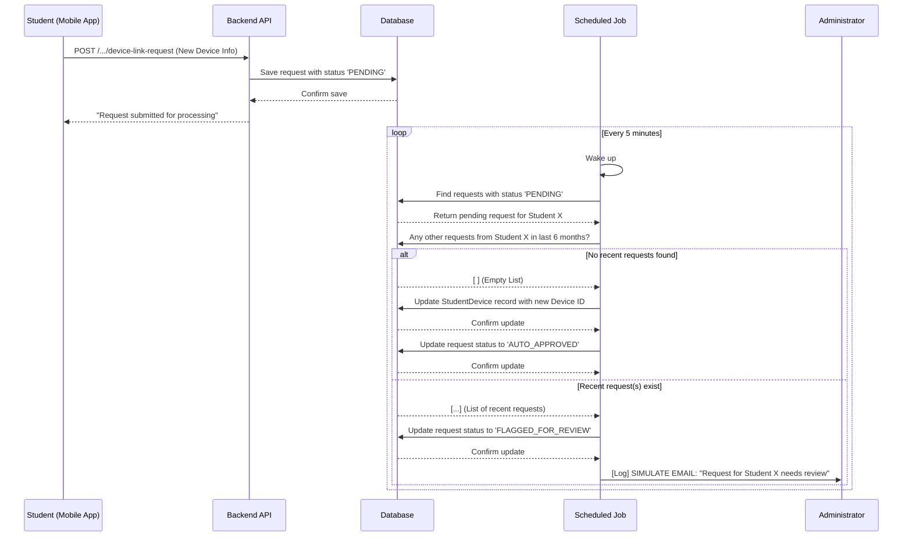

# FINKI Attendance Application: Technical Presentation

## 1. Project Overview

The FINKI Attendance Application is a modern, cross-platform mobile solution designed to streamline and secure the process of tracking student attendance at the university. It replaces manual sign-in sheets with a robust system involving QR codes and Bluetooth proximity verification, ensuring accuracy and integrity.

The system is composed of two primary components:
- A **Flutter-based mobile application** for students and professors.
- A **Spring Boot-based backend API** that serves as the central hub for all data and business logic.

---

## 2. System Architecture

The architecture is a classic client-server model:

- **Client (Mobile App):** A single Flutter codebase that provides a tailored user interface and experience based on the authenticated user's role (Student or Professor). It communicates with the backend via a RESTful API.
- **Server (Backend API):** A reactive Spring Boot application connected to a PostgreSQL database. It manages all data, handles business logic, and exposes secure endpoints for the mobile client.

---

## 3. Mobile Application (Flutter)

The mobile app is the primary interface for all users.

### Key Technologies
- **Framework:** Flutter 3 with Dart
- **State Management:** Provider package for dependency injection and state management, separated into logical units (`UserProvider`, `DateProvider`, `TimeProvider`).
- **Networking:** `http` package for making API calls to the backend.
- **Local Storage & Caching:**
    - `shared_preferences`: Used for implementing a cache-first strategy for non-sensitive, frequently accessed data like lists of professors, rooms, and subjects.
    - `flutter_secure_storage`: Used for securely storing sensitive data like authentication tokens.
    - `cached_network_image`: Integrated to efficiently cache any user profile images loaded from the network.
- **Hardware Interaction:**
    - `mobile_scanner`: For fast and efficient QR code scanning.
    - `flutter_blue_plus`: For Bluetooth LE (BLE) scanning to detect proximity to classroom beacons.

### Core Features

#### Role-Based Interface
- The app presents a different dashboard and set of functionalities depending on whether the user is a **Student** or a **Professor**.

#### Student Features
- **Dashboard:** View a list of scheduled classes for the selected day and time. A local search filter allows for quick filtering by subject, professor, or room name.
- **Live Highlighting:** Classes that are currently ongoing based on the system's real time are visually highlighted for easy identification.
- **Calendar View:** A timeline view showing the student's schedule for any selected day.
- **QR Code Attendance:** Students can scan a QR code generated by the professor to mark their attendance. This process is secured by a subsequent Bluetooth proximity check.
- **Profile & Attendance Summary:** A personalized profile screen that displays the student's initials and a summary of their attendance statistics (e.g., overall percentage, classes attended) for the current semester, fetched directly from the API.

#### Professor Features
- **Dashboard:** View a list of classes the professor is teaching on a given day. The list can be filtered by subject, room, or a text search query.
- **Calendar View:** A timeline view of the professor's teaching schedule.
- **On-the-Fly QR Generation:** Professors can select any of their scheduled classes to generate a secure, time-limited QR code for attendance. This now includes a shareable web link for students who may have trouble with their camera.
- **Attendance Tracking:** View a list of students who have successfully marked their attendance for a given class session.

### Caching Strategy
The mobile app employs a **cache-first, then network** strategy for relatively static data:
1. When a list of professors, rooms, or subjects is requested, the app first checks `shared_preferences` for a cached version.
2. If cached data exists, it is displayed immediately, providing a fast, offline-capable user experience.
3. The app then attempts to fetch fresh data from the network in the background. If successful, it updates the cache for future use. If the network call fails, the app continues to function with the existing cached data.

---

## 4. Backend API (Spring Boot)

The server is the authoritative source for all data and logic.

### Key Technologies
- **Framework:** Java 21 with Spring Boot 3 (WebFlux for reactive programming).
- **Database:** PostgreSQL with R2DBC for non-blocking database access.
- **Database Migrations:** Liquibase for managing and versioning the database schema.
- **API Documentation:** SpringDoc (Swagger UI) for clear, interactive API documentation.
- **Caching:** Spring Cache abstraction with a Caffeine implementation for in-memory caching of short-lived, computationally expensive data.

### Core Features & Endpoints

- **Data Management:** Provides standard CRUD operations for all core entities (Students, Professors, Courses, Subjects, Rooms, etc.).
- **Attendance Logic:**
    - **Registration (`/api/attendance/register`):** Validates a student's QR code token. If valid, it creates a `PENDING_VERIFICATION` attendance record.
    - **Confirmation (`/api/attendance/confirm`):** Receives the attendance ID and the student's Bluetooth proximity. It updates the record to `PRESENT` or `ABSENT` based on this information.
- **QR Code Generation (`/api/qr/generateQR`):**
    1. Generates a secure, unique, and time-limited (15 minutes) token.
    2. Stores this token associated with the specific class session.
    3. Returns a PNG image of the QR code representing the token.
- **Presentation Service (`/p/{shortKey}`):**
    - When a professor generates a QR code, a short-lived key is also created and cached using Caffeine.
    - This endpoint serves a simple HTML page that displays the QR code image, allowing students to open a link instead of scanning directly.
- **Attendance Summary Endpoint (`/api/students/{studentIndex}/attendance-summary`):**
    - A dedicated endpoint that calculates and returns a student's attendance statistics for a given semester.
    - It efficiently queries the database to count total vs. attended classes, ensuring the mobile app's profile screen is populated with relevant data.
- **Secure Device Linking (`POST /api/students/{studentIndex}/device-link-request`):**
    - Implements a secure, automated workflow for students who need to switch their registered attendance device.
    - Instead of allowing instant changes, the system creates a `PENDING` request.
    - A scheduled job runs every 5 minutes to process these requests.
    - **Automated Approval:** The job automatically approves requests if the student has not had another device change in a configurable time window (e.g., 6 months).
    - **Flagging for Review:** If a recent request is found, the new request is flagged, and a notification is sent to an administrator for manual review. This prevents abuse while minimizing administrative overhead.

### Caching Strategy
- The backend uses a **Caffeine-based in-memory cache** for the presentation service.
- When a QR code is generated, the image data is stored in the cache with the short key.
- This is a write-through cache with a 15-minute time-to-live, matching the QR token's validity period. This ensures that the presentation links are only valid for a short time and that the server doesn't need to re-generate the QR image for every web request.

---

## 5. Automated Device Link Workflow (Sequence Diagram)

This diagram illustrates the secure, automated process for handling a student's request to change their registered device.

---

## 6. Bluetooth Beacon (`blt-beacon`)

- **Role:** This component is responsible for broadcasting a unique Bluetooth Low Energy (BLE) signal within a classroom.
- **Function:** The mobile app scans for this specific signal during the attendance confirmation step. By measuring the signal strength (RSSI), the app determines the student's physical proximity to the beacon, adding a crucial layer of security and preventing remote or fraudulent check-ins.
