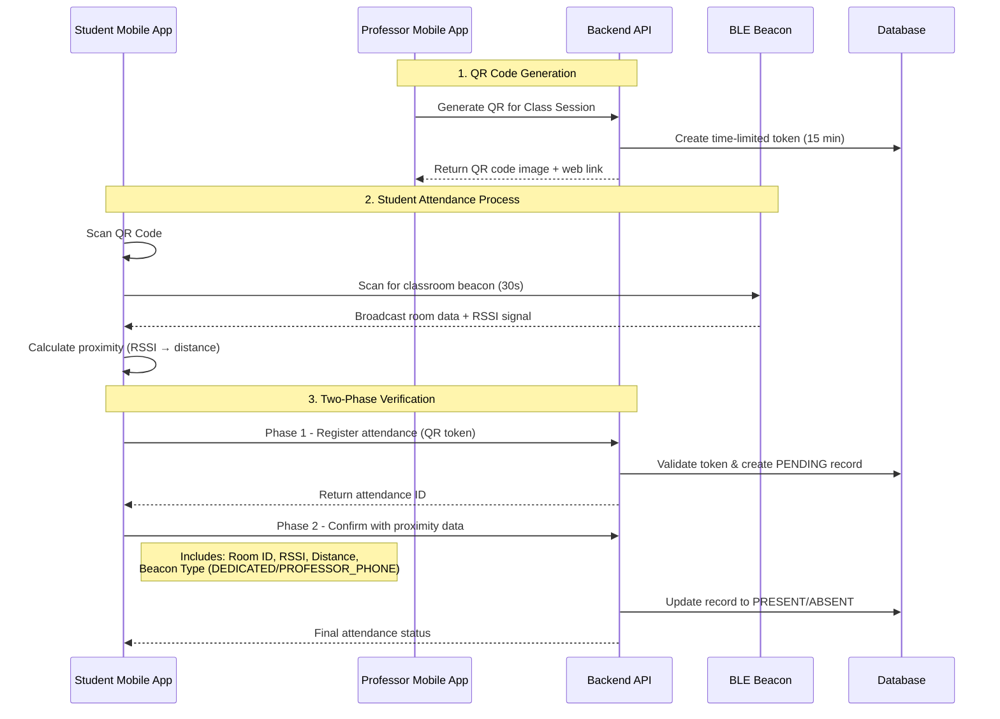
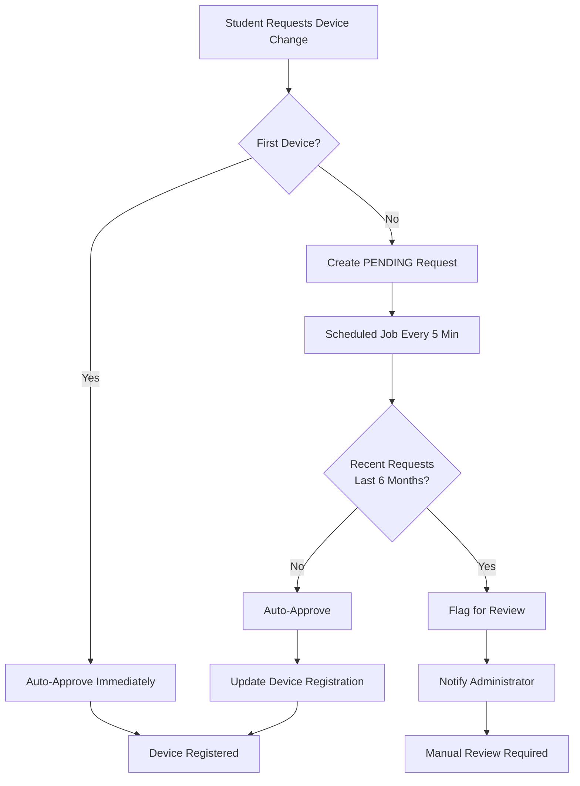

# FINKI Attendance Application: Technical Presentation

## 1. Project Overview

The FINKI Attendance Application is a modern, cross-platform mobile solution designed to streamline and secure the process of tracking student attendance at the university. It replaces manual sign-in sheets with a robust system involving QR codes and Bluetooth proximity verification, ensuring accuracy and integrity.

The system is composed of three primary components:
- A **Flutter-based mobile application** for students and professors
- A **Spring Boot-based backend API** that serves as the central hub for all data and business logic
- **Arduino-based BLE beacons** deployed in classrooms for proximity verification

---

## 2. System Architecture

The architecture follows a distributed client-server model with IoT integration:

- **Client (Mobile App):** A single Flutter codebase providing role-based interfaces (Student/Professor)
- **Server (Backend API):** Reactive Spring Boot application with PostgreSQL database
- **IoT Layer (BLE Beacons):** Arduino UNO R4 WiFi devices broadcasting classroom location data

### Technology Stack
- **Frontend:** Flutter 3 + Dart + Provider state management
- **Backend:** Java 21 + Spring Boot 3 (WebFlux) + PostgreSQL + R2DBC
- **IoT:** Arduino UNO R4 WiFi + Bluetooth LE + Custom beacon protocol
- **Security:** JWT tokens + Device fingerprinting + Proximity verification

---

## 3. Student Attendance Verification Workflow

The attendance verification process combines multiple security layers to prevent fraud:



### Security Measures
1. **Time-Limited QR Codes:** 15-minute expiration prevents reuse
2. **Device Registration:** Hardware fingerprinting ties attendance to specific devices
3. **Proximity Verification:** RSSI-based distance calculation (≤5m for attendance)
4. **Beacon Type Validation:** Distinguishes between dedicated beacons and professor phones
5. **Two-Phase Commit:** Separate registration and confirmation steps

---

## 4. BLE Beacon Infrastructure

### Hardware Specifications
- **Device:** Arduino UNO R4 WiFi
- **Connectivity:** Bluetooth LE 5.0 + WiFi capabilities
- **Power:** USB or external 5V supply
- **Range:** ~20m effective classroom coverage
- **Cost:** ~$30 per classroom

### Beacon Protocol Design
```cpp
struct BeaconData {
    char room_id[8];      // "101A", "205B"
    char building[8];     // "FINKI", "TMF"
    char beacon_id[8];    // "BCN01", "BCN02"
    uint8_t floor;        // Floor number
    int8_t tx_power;      // Calibrated transmission power
    uint32_t uptime;      // Device uptime (monitoring)
    uint32_t timestamp;   // Current timestamp
    uint8_t beacon_type;  // 0=dedicated, 1=mobile
} __attribute__((packed)); // 40 bytes total
```

### Production Features
- **Auto-Recovery:** Automatic restart on failures (max 5 attempts)
- **Watchdog Timer:** 30-second timeout protection
- **Configuration Validation:** Startup parameter verification
- **Performance Monitoring:** Uptime and error tracking
- **JSON + Binary Formats:** Dual protocol support for compatibility

### Deployment Strategy
1. **Per-Classroom Installation:** One beacon per classroom
2. **Configuration Management:** Centralized room mapping
3. **Maintenance Protocol:** Remote monitoring via uptime data
4. **Redundancy:** Professor phone backup beacons
5. **Calibration:** TX power tuning for optimal range

---

## 5. Device Linking & Security

### Automated Device Management
The system implements a sophisticated device linking workflow to balance security with usability:



### Security Benefits
- **Fraud Prevention:** Prevents rapid device switching abuse
- **Automated Processing:** Reduces administrative overhead
- **Audit Trail:** Complete history of device changes
- **Flexible Timeframes:** Configurable approval windows (default: 6 months)

---

## 6. Mobile Application (Flutter)

The mobile app is the primary interface for all users.

### Key Technologies
- **Framework:** Flutter 3 with Dart
- **State Management:** Provider package for dependency injection and state management, separated into logical units (`UserProvider`, `DateProvider`, `TimeProvider`).
- **Networking:** `http` package for making API calls to the backend.
- **Local Storage & Caching:**
    - `shared_preferences`: Used for implementing a cache-first strategy for non-sensitive, frequently accessed data like lists of professors, rooms, and subjects.
    - `flutter_secure_storage`: Used for securely storing sensitive data like authentication tokens.
    - `cached_network_image`: Integrated to efficiently cache any user profile images loaded from the network.
- **Hardware Interaction:**
    - `mobile_scanner`: For fast and efficient QR code scanning.
    - `flutter_blue_plus`: For Bluetooth LE (BLE) scanning to detect proximity to classroom beacons.

### Core Features

#### Role-Based Interface
- The app presents a different dashboard and set of functionalities depending on whether the user is a **Student** or a **Professor**.

#### Student Features
- **Dashboard:** View a list of scheduled classes for the selected day and time. A local search filter allows for quick filtering by subject, professor, or room name.
- **Live Highlighting:** Classes that are currently ongoing based on the system's real time are visually highlighted for easy identification.
- **Calendar View:** A timeline view showing the student's schedule for any selected day.
- **QR Code Attendance:** Students can scan a QR code generated by the professor to mark their attendance. This process is secured by a subsequent Bluetooth proximity check.
- **Profile & Attendance Summary:** A personalized profile screen that displays the student's initials and a summary of their attendance statistics (e.g., overall percentage, classes attended) for the current semester, fetched directly from the API.

#### Professor Features
- **Dashboard:** View a list of classes the professor is teaching on a given day. The list can be filtered by subject, room, or a text search query.
- **Calendar View:** A timeline view of the professor's teaching schedule.
- **On-the-Fly QR Generation:** Professors can select any of their scheduled classes to generate a secure, time-limited QR code for attendance. This now includes a shareable web link for students who may have trouble with their camera.
- **Attendance Tracking:** View a list of students who have successfully marked their attendance for a given class session.

### Caching Strategy
The mobile app employs a **cache-first, then network** strategy for relatively static data:
1. When a list of professors, rooms, or subjects is requested, the app first checks `shared_preferences` for a cached version.
2. If cached data exists, it is displayed immediately, providing a fast, offline-capable user experience.
3. The app then attempts to fetch fresh data from the network in the background. If successful, it updates the cache for future use. If the network call fails, the app continues to function with the existing cached data.

### Proximity Integration
- **Real-Time Scanning:** 30-second beacon detection window
- **Distance Calculation:** RSSI-to-meters conversion with environmental factors
- **Fallback Mechanisms:** Graceful degradation when beacons unavailable
- **Performance Optimization:** BLE scan rate limiting and battery management

---

## 7. Backend API (Spring Boot)

The server is the authoritative source for all data and logic.

### Key Technologies
- **Framework:** Java 21 with Spring Boot 3 (WebFlux for reactive programming).
- **Database:** PostgreSQL with R2DBC for non-blocking database access.
- **Database Migrations:** Liquibase for managing and versioning the database schema.
- **API Documentation:** SpringDoc (Swagger UI) for clear, interactive API documentation.
- **Caching:** Spring Cache abstraction with a Caffeine implementation for in-memory caching of short-lived, computationally expensive data.

### Core Features & Endpoints

- **Data Management:** Provides standard CRUD operations for all core entities (Students, Professors, Courses, Subjects, Rooms, etc.).
- **Attendance Logic:**
    - **Registration (`/api/attendance/register`):** Validates a student's QR code token. If valid, it creates a `PENDING_VERIFICATION` attendance record.
    - **Confirmation (`/api/attendance/confirm`):** Receives the attendance ID and the student's Bluetooth proximity. It updates the record to `PRESENT` or `ABSENT` based on this information.
- **QR Code Generation (`/api/qr/generateQR`):**
    1. Generates a secure, unique, and time-limited (15 minutes) token.
    2. Stores this token associated with the specific class session.
    3. Returns a PNG image of the QR code representing the token.
- **Presentation Service (`/p/{shortKey}`):**
    - When a professor generates a QR code, a short-lived key is also created and cached using Caffeine.
    - This endpoint serves a simple HTML page that displays the QR code image, allowing students to open a link instead of scanning directly.
- **Attendance Summary Endpoint (`/api/students/{studentIndex}/attendance-summary`):**
    - A dedicated endpoint that calculates and returns a student's attendance statistics for a given semester.
    - It efficiently queries the database to count total vs. attended classes, ensuring the mobile app's profile screen is populated with relevant data.
- **Secure Device Linking (`POST /api/students/{studentIndex}/device-link-request`):**
    - Implements a secure, automated workflow for students who need to switch their registered attendance device.
    - Instead of allowing instant changes, the system creates a `PENDING` request.
    - A scheduled job runs every 5 minutes to process these requests.
    - **Automated Approval:** The job automatically approves requests if the student has not had another device change in a configurable time window (e.g., 6 months).
    - **Flagging for Review:** If a recent request is found, the new request is flagged, and a notification is sent to an administrator for manual review. This prevents abuse while minimizing administrative overhead.

### Enhanced Proximity Features
- **Proximity Verification Service:** Dedicated service for beacon data processing
- **Analytics & Reporting:** Room-based attendance analytics
- **Beacon Management:** Support for multiple beacon types and configurations
- **Performance Monitoring:** Response time tracking and caching strategies

### Caching Strategy
- The backend uses a **Caffeine-based in-memory cache** for the presentation service.
- When a QR code is generated, the image data is stored in the cache with the short key.
- This is a write-through cache with a 15-minute time-to-live, matching the QR token's validity period. This ensures that the presentation links are only valid for a short time and that the server doesn't need to re-generate the QR image for every web request.

---

## 8. Possible Improvements

### Short-Term Enhancements
1. **Machine Learning Integration**
   - Anomaly detection for unusual attendance patterns
   - Predictive analytics for at-risk students
   - RSSI signal quality improvement algorithms

2. **Enhanced Beacon Network**
   - Mesh networking between beacons
   - Real-time configuration updates via WiFi
   - Battery-powered beacons for flexible deployment

3. **User Experience Improvements**
   - Offline attendance queue with sync
   - Push notifications for schedule changes
   - Biometric authentication option

### Long-Term Vision
1. **AI-Powered Analytics**
   - Attendance prediction models
   - Academic performance correlation analysis
   - Automated intervention recommendations

2. **Campus-Wide Integration**
   - Building access control integration
   - Smart classroom management
   - Energy optimization based on occupancy

3. **Advanced Security Features**
   - Facial recognition backup verification
   - Behavioral biometrics (typing patterns)
   - Blockchain-based attendance ledger

### Technical Debt & Optimizations
1. **Performance Improvements**
   - Database query optimization
   - Mobile app bundle size reduction
   - CDN integration for static assets

2. **Scalability Enhancements**
   - Microservices architecture migration
   - Event-driven processing
   - Horizontal scaling with load balancers

3. **Monitoring & Observability**
   - Distributed tracing implementation
   - Real-time performance dashboards
   - Predictive maintenance for beacons

---

## 9. Technical Metrics & Performance

### Current System Performance
- **QR Generation:** <200ms average response time
- **Attendance Registration:** <500ms end-to-end
- **Beacon Detection:** 95% success rate within 30 seconds
- **Database Operations:** <100ms average query time
- **Mobile App Size:** <50MB total bundle

### Scalability Targets
- **Concurrent Users:** 1000+ simultaneous students
- **Daily Attendance Records:** 50,000+ transactions
- **Beacon Network:** 200+ classroom deployments
- **Data Retention:** 5+ years with efficient archival

---

**Tech Stack Summary**: Flutter • Spring Boot • PostgreSQL • Arduino • Bluetooth LE • JWT • R2DBC • Provider • WebFlux
