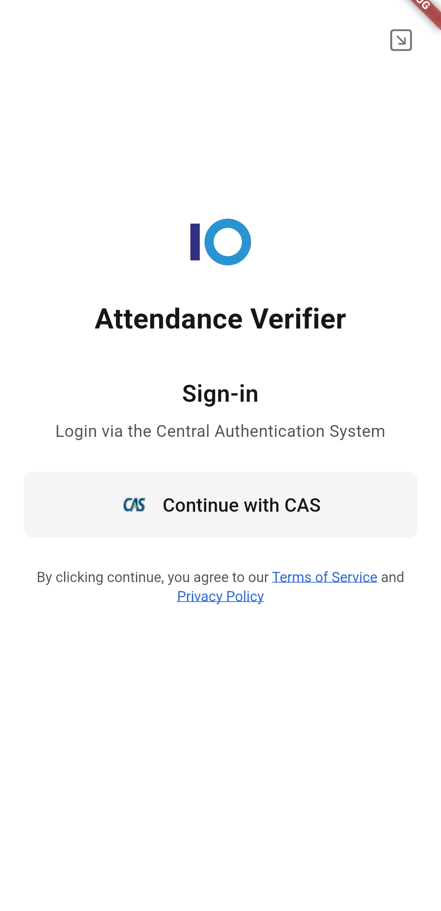
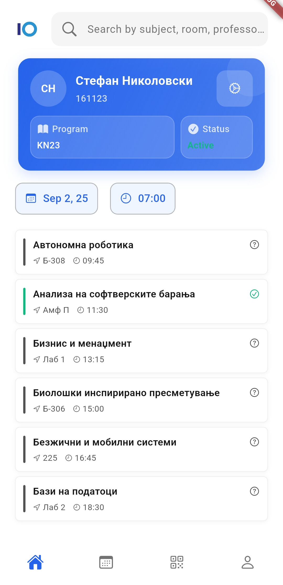
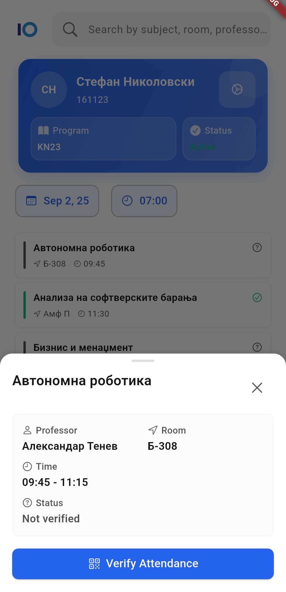
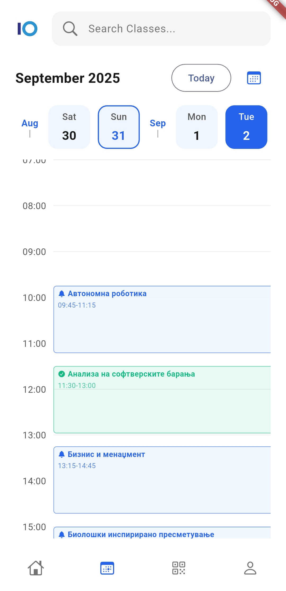
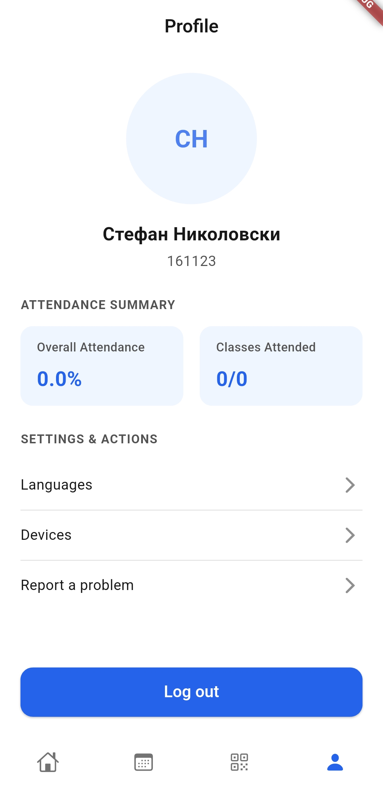
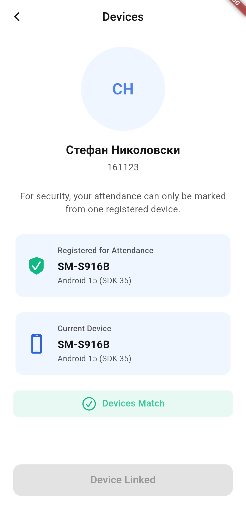
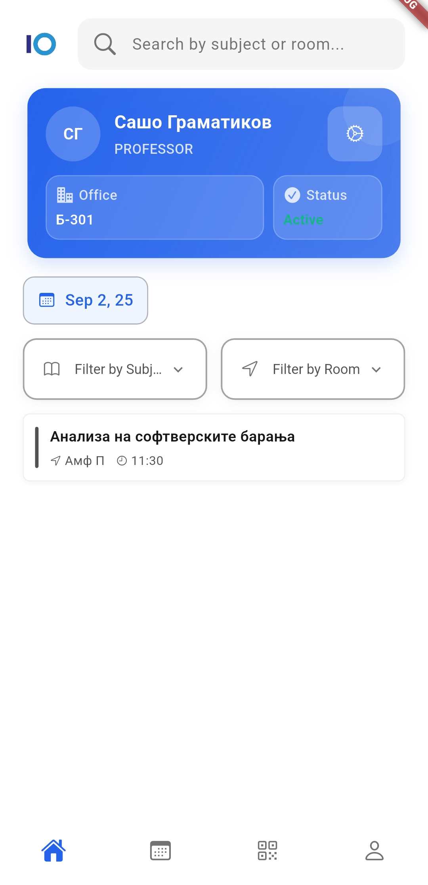
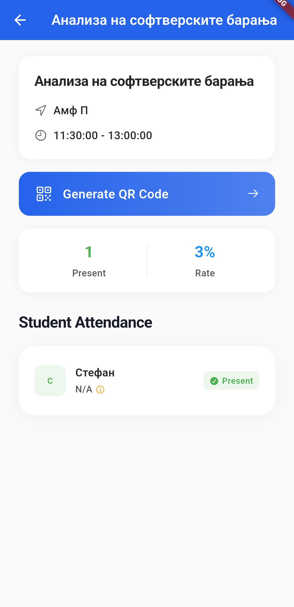

# Attendance Application

A modern, secure mobile attendance system for universities that combines QR code scanning with Bluetooth proximity verification to prevent attendance
fraud and streamline classroom management.

## Overview

This system replaces traditional paper-based attendance with a three-component solution:

- **Flutter Mobile App**: Cross-platform interface for students and professors
- **Spring Boot API**: Reactive backend with PostgreSQL database
- **Arduino BLE Beacons**: Classroom proximity verification devices

### Key Innovation

**Dual-layer security**: QR codes for session identification + Bluetooth proximity verification to ensure physical presence in the classroom.

## Architecture

```
┌─────────────────┐    ┌─────────────────┐    ┌─────────────────┐
│   Mobile App    │◄──►│   Backend API   │◄──►│    Database     │
│   (Flutter)     │    │  (Spring Boot)  │    │  (PostgreSQL)   │
└─────────────────┘    └─────────────────┘    └─────────────────┘
         ▲                        ▲
         │                        │
         ▼                        ▼
┌─────────────────┐    ┌─────────────────┐
│  BLE Beacons    │    │   JWT Security  │
│   (Arduino)     │    │ + Device Linking│
└─────────────────┘    └─────────────────┘
```

## ⚡ Quick Start

### Prerequisites

- Flutter 3.x, Java 21+, Docker
- Physical device with camera and Bluetooth

### Run the System

```bash
# 1. Start backend
cd server && ./gradlew bootRun

# 2. Run mobile app  
cd mobile/attendance_app && flutter pub get && flutter run

# 3. Deploy beacons (optional)
# Flash Arduino UNO R4 WiFi with ble-beacon/arduino/beacon.ino
```

## Project Structure

```
attendance-app/
├── mobile/attendance_app/    # Flutter app (students + professors)
├── server/                   # Spring Boot API + PostgreSQL
├── ble-beacon/arduino/       # Arduino beacon firmware
├── PRESENTATION_README.md    # Detailed technical documentation
└── mockups/                  # UI/UX design assets
```

## Security Features

- **Time-Limited QR Codes**: 15-minute expiration prevents sharing
- **Proximity Verification**: Bluetooth RSSI distance calculation (≤5m)
- **Device Fingerprinting**: Hardware-based student device linking
- **Automated Fraud Detection**: ML-based pattern analysis
- **Two-Phase Verification**: Registration + proximity confirmation

## Documentation

- **[Mobile App Guide](./mobile/attendance_app/README.md)** - Development setup and features
- **[Backend API Docs](./server/README.md)** - Server configuration and endpoints
- **[Beacon Setup](./ble-beacon/arduino/README.md)** - Hardware deployment guide

## 📊 Tech Stack

| Component    | Technologies                               |
|--------------|--------------------------------------------|
| **Frontend** | Flutter 3, Dart, Provider                  |
| **Backend**  | Java 21, Spring Boot 5, WebFlux, R2DBC     |
| **Database** | PostgreSQL, Liquibase migrations           |
| **Security** | Device fingerprinting, RSSI proximity |
| **IoT**      | Arduino UNO R4 WiFi, Bluetooth LE 5.0      |

## Application's visual design

Some pictures are listed below, more of them can be viewed [here](./mockups/demo).

<p align="center">
    
    
    
    
    
    
    
    
    
</p>
